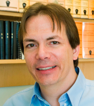

          <h3>Keynote speakers</h3>

           
          <table width="100%" border="1">
            <tbody>
              <tr>
                <td> 
                </td>
                <td><a href="https://eichlerlab.gs.washington.edu/">Evan E.
                    Eichler</a> 
                  Professor 
                  University of Washington, Seattle, WA, United States</td>
              </tr>
              <tr>
                <td> 
                </td>
                <td><a href="https://roylab.discovery.wisc.edu/">Sushmita Roy</a> 
                  Professor 
                  University of Wisconsin, Madison, WI, United States</td>
              </tr>
              <tr>
                <td> 
                </td>
                <td><a href="http://augroup.org/">Kin Fai Au</a> 
                  Professor 
                  University of Michigan, Ann Arbor, MI, United States</td>
              </tr>
            </tbody>
          </table>
           
          
 
          

	  
	  <h3>Saturday July 13, 2024</h3>

	  
All times listed are in EDT, Room: 517d

	  <table style="width: 100%;" border="0">
	    <tbody>
	      <tr>
		<td style="vertical-align: top;"><strong>10:40-10:45</strong></td>
		<td><strong>Welcome remarks</strong></td>
	      </tr>
	      
	      <tr><td style="vertical-align: top;"><strong>10:45-11:40</strong></td><td>
		  <strong>Keynote:</strong> Unsupervised learning approaches for genomics to decipher structure and dynamics of 3D genome organization and gene regulatory networks 
		  Presenter: Sushmita Roy, University of Wisconsin, Madison, WI, United States 
		  Format: In Person</td></tr>

	      <tr><td style="vertical-align: top;"><strong>11:40-12:00</strong></td><td>
		  An Adaptive K-Nearest Neighbor Graph Optimized for Single-cell and Spatial Clustering 
		  Presenter: Qi Liu, Vanderbilt University Medical Center, United States 

		  Format: In Person</td></tr>

	      <tr><td style="vertical-align: top;"><strong>12:00-12:20</strong></td><td>
		  Proceedings Presentation: Forseti: A mechanistic and predictive model of the splicing status of scRNA-seq reads 
		  Presenter: Yuan Gao, University of Maryland, College Park, United States 

		  Format: In Person</td></tr>

	      <tr><td style="vertical-align: top;"><strong>12:20-12:40</strong></td><td>
		  <strong>Keynote:</strong> Computational Advances In Multiomics Analysis Using HiFi Sequencing 
		  Presenter: Liz Tseng, Pacific Biosciences 
		    Format: In person</td></tr>

	      <tr><td style="vertical-align: top;"><strong>14:20-14:40</strong></td><td>
		  Proceedings Presentation: Sigmoni: classification of nanopore signal with a compressed pangenome index 
		  Presenter: Vikram Shivakumar, Johns Hopkins University, United States 

		  Format: In Person</td></tr>

	      <tr><td style="vertical-align: top;"><strong>14:40-15:00</strong></td><td>
		  Proceedings Presentation: Label-guided seed-chain-extend alignment on annotated De Bruijn graphs 
		  Presenter: Harun Mustafa, ETH Zurich, Switzerland 

		  Format: In Person</td></tr>

	      <tr><td style="vertical-align: top;"><strong>15:00-15:20</strong></td><td>
		  Compressed Indexing for Pangenome Substring Queries 
		  Presenter: Stephen Hwang, XDBio Program, Johns Hopkins School of Medicine, United States 

		  Format: In Person</td></tr>

	      <tr><td style="vertical-align: top;"><strong>15:20-15:40</strong></td><td>
		  Sequence-to-graph alignment based copy number calling using a flow network formulation 
		  Presenter: Hugo Magalhães, Institute for Medical Biometry and Bioinformatics, Medical Faculty, and Center for Digital Medicine, HHU, Düsseldorf, Germany 

		  Format: In Person</td></tr>

	      <tr><td style="vertical-align: top;"><strong>15:40-16:00</strong></td><td>
		  Targeted genotyping of complex polymorphic genes using short and long reads 
		  Presenter: Timofey Prodanov, Institute for Medical Biometry and Bioinformatics, Heinrich Heine University, 40225 Düsseldorf, Germany, Germany 

		  Format: In Person</td></tr>

	      <tr><td style="vertical-align: top;"><strong>16:40-17:00</strong></td><td>
		  VISTA: An integrated framework for structural variant discovery 
		  Presenter: Varuni Sarwal, UCLA, United States 

		  Format: In Person</td></tr>

	      <tr><td style="vertical-align: top;"><strong>17:00-18:00</strong></td><td>
		  <strong>Keynote:</strong> Long-read sequencing and pangenome perspective of structural variation 
		  Presenter: University of Washington, Seattle, WA, United States     
		  Format: In person</td></tr>
	      </tbody>
	    </table>

	    <h3>Sunday, July 14, 2024</h3>

	    
All times listed are in EDT, Room: 517d

	    
	    <table style="width: 100%;" border="0">
	      <tbody>
		<tr><td style="vertical-align: top;"><strong>10:40-11:40</strong></td><td>
		    <strong>Keynote:</strong> Why and how long reads are used to improve gene isoform quantification 
		    Presenter: Kin Fai Au, University of Michigan, Ann Arbor, MI, United States 
		    Format: In person</td></tr>

		<tr><td style="vertical-align: top;"><strong>11:40-12:00</strong></td><td>
		    Telomere-to-telomere assembly by preserving contained reads 
		    Presenter: Sudhanva Shyam Kamath, Indian Institute of Science, Bangalore, India 

		    Format: Live Stream</td></tr>

		<tr><td style="vertical-align: top;"><strong>12:00-12:20</strong></td><td>
		    Rawsamble: Overlapping and Assembling Raw Nanopore Signals using a Hash-based Seeding Mechanism 
		    Presenter: Can Firtina, ETH Zurich, Switzerland 

		    Format: In Person</td></tr>

		<tr><td style="vertical-align: top;"><strong>14:20-14:40</strong></td><td>
		    Proceedings Presentation: Conway-Bromage-Lyndon (CBL): an exact, dynamic representation of k-mer sets 
		    Presenter: Igor Martayan, Univ Lille, France 

		    Format: In Person</td></tr>

		<tr><td style="vertical-align: top;"><strong>14:40-15:00</strong></td><td>
		    Proceedings Presentation: Learning Locality-Sensitive Bucketing Functions 
		    Presenter: Xin Yuan, Pennsylvania State University, United States 

		    Format: In Person</td></tr>

		<tr><td style="vertical-align: top;"><strong>15:00-15:20</strong></td><td>
		    Proceedings Presentation: Fast Multiple Sequence Alignment via Multi-Armed Bandits 
		    Presenter: Kayvon Mazooji, University of Illinois Urbana-Champaign, United States 

		    Format: In Person</td></tr>

		<tr><td style="vertical-align: top;"><strong>15:20-15:40</strong></td><td>
		    Contrasting and Combining Transcriptome Complexity Captured by Short and Long RNA Sequencing Reads 
		    Presenter: Seong Woo Han, University of Pennsylvania, United States 

		    Format: In Person</td></tr>

		<tr><td style="vertical-align: top;"><strong>15:40-16:00</strong></td><td>
		    Quantum Computing for Genomic Analysis 
		    Presenter: Sergii Strelchuk, University of Cambridge, United Kingdom 

		    Format: In Person</td></tr>

		<tr><td style="vertical-align: top;"><strong>16:40-17:00</strong></td><td>
		    Proceedings Presentation: Adaptive Digital Tissue Deconvolution 
		    Presenter: Franziska Görtler, Department of Oncology and Medical Physics, Haukeland University Hospital, Norway 

		    Format: In Person</td></tr>

		<tr><td style="vertical-align: top;"><strong>17:00-17:20</strong></td><td>
		    Maximizing accuracy of cellular deconvolution. (ACeD) 
		    Presenter: Jonathan Bard, State University of New York at Buffalo, United States 

		    Format: In Person</td></tr>

		<tr><td style="vertical-align: top;"><strong>17:20-17:40</strong></td><td>
		    Evolution of genomic and epigenomic heterogeneity in prostate cancer from tissue and liquid biopsy 
		    Presenter: Marjorie Roskes, Weill Cornell Medicine, United States 

		    Format: In Person</td></tr>

		<tr><td style="vertical-align: top;"><strong>17:40-18:00</strong></td><td>
		    Accurate and robust bootstrap inference of single-cell phylogenies by integrating sequencing read counts 
		    Presenter: Rija Zaidi, University College London Cancer Institute, United Kingdom 

		    Format: In Person</td></tr>
	      </tbody>
	    </table>
	     

